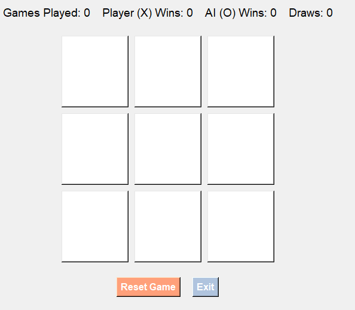
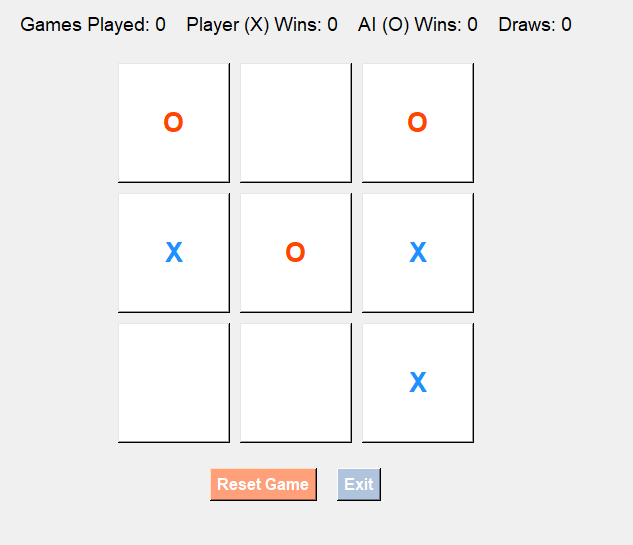
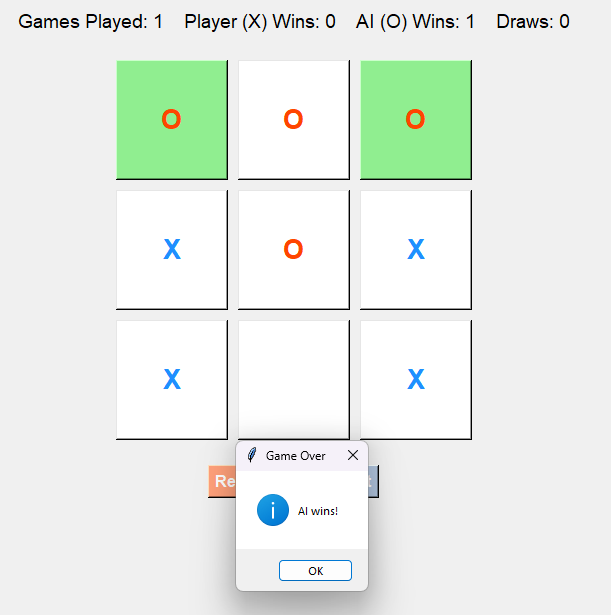

# Enhanced Tic Tac Toe with AI

Welcome to **Enhanced Tic Tac Toe with AI**! This project is a visually appealing and interactive Tic Tac Toe game developed using Python's `tkinter` library. The game includes an AI opponent powered by the Minimax algorithm to ensure a challenging gameplay experience. It also features a score-tracking system and enhanced UI elements for an engaging user experience.

---

## Features

- **Player vs AI Gameplay:** Play against an AI opponent with optimal moves calculated using the Minimax algorithm.
- **Dynamic UI:**
  - Highlight winning combinations.
  - Button animations for enhanced visual appeal.
  - Custom colors for player (Dodger Blue) and AI (Orange Red).
- **Score Tracking:** Keep track of wins, draws, and games played.
- **Responsive Design:** The game grid adjusts to the window size.
- **Controls:**
  - Reset the game to start a new match.
  - Exit the game with ease.

---

## How to Play

1. The player (`X`) always starts first.
2. Click on an empty grid cell to make your move.
3. The AI (`O`) will respond with its calculated move.
4. The game ends when either the player or AI wins, or when the grid is full (draw).
5. A popup will display the game result, and the score will update automatically.
6. Use the **Reset Game** button to play again or **Exit** to close the application.

---

## Installation

1. Clone the repository:
   ```bash
   git clone <repository-url>
   ```
2. Navigate to the project directory:
   ```bash
   cd enhanced-tictactoe
   ```
3. Run the game:
   ```bash
   python tictactoe.py
   ```

Ensure you have Python 3.x installed along with the `tkinter` library.

---

## Screenshots

### Main Menu


### Gameplay


### Winning Highlight


---

## Code Highlights

### Minimax Algorithm
The AI uses the Minimax algorithm to determine the best possible move:
```python
    def minimax(self, new_board, is_maximizing):
        winner = self.check_winner_minimax(new_board)
        if winner == AI:
            return {'score': 1}
        elif winner == PLAYER:
            return {'score': -1}
        elif EMPTY not in new_board:
            return {'score': 0}

        if is_maximizing:
            best = {'score': -math.inf}
            for i in range(9):
                if new_board[i] == EMPTY:
                    new_board[i] = AI
                    score = self.minimax(new_board, False)
                    new_board[i] = EMPTY
                    score['index'] = i
                    if score['score'] > best['score']:
                        best = score
            return best
        else:
            best = {'score': math.inf}
            for i in range(9):
                if new_board[i] == EMPTY:
                    new_board[i] = PLAYER
                    score = self.minimax(new_board, True)
                    new_board[i] = EMPTY
                    score['index'] = i
                    if score['score'] < best['score']:
                        best = score
            return best
```

### Winning Combination Highlight
Winning cells are visually highlighted:
```python
    def highlight_winning_combo(self, combo):
        for index in combo:
            self.buttons[index].config(bg=HIGHLIGHT_COLOR)
```

---

## Future Enhancements

- Add multiplayer support for local play.
- Implement a difficulty level for the AI.
- Add sound effects for moves and game results.

---

## License

This project is licensed under the MIT License. See the LICENSE file for more details.

---

## Contributing

Contributions are welcome! Feel free to fork the repository, create a branch, and submit a pull request.

---

Thank you for checking out the Enhanced Tic Tac Toe game! Enjoy playing and feel free to share your feedback. 🎮